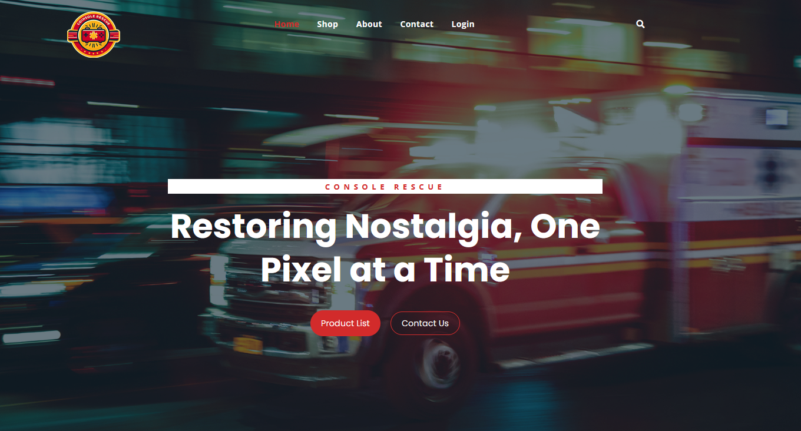

# What is Console Rescue?
Console Rescue is a e-commerce website that allows users to buy repair parts for their retro gaming devices. 
Pay for your items using your own Paypal account! (sandbox)

# How to Set Up?
   - Ensure MySQL80 is running and configured correctly in `application.properties`.
   - Update `spring.mail` with the desired email address for notifications.
   - Run `ConsoleRescueApplication.java`.
   - Access the application at `http://localhost:8080/`.
   - Log in to PayPal Sandbox

# IMPORTANT
1. **You have to have your own Email Address in application.properties**
2. **In cart.html, input your own PayPalAPI Key**

# Credits
HTML Template Used : https://imransdesign.com/project/fruitkha/
Images Taken: https://retrogamerepairshop.com

# Screenshot

